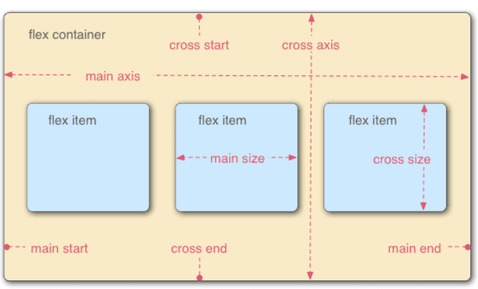

# flex

`css3` 引入了一种新布局： `flex` 布局

`flex` 是 `flexible box` 也称为弹性盒模型

`flexbox` 不是一个属性，而是一个模块，包括多个属性

弹性布局提供了一种更加有效的方式来进行容器内的布局，以适应各种类型的显示设备和各种尺寸的屏幕

## display

让一个元素变成伸缩容器，需要使用 `display` 属性。采用 `flex` 布局的元素，称为伸缩容器（`flex container`），容器内的子元素称为伸缩项目（`flex item`）

注：浏览器会将任何之间在伸缩容器里的连续文字块包起来成为匿名伸缩项目

使用 `flex` 布局实际上是使元素 `FFC` 化（`flex formatting context` 伸缩格式上下文），`FFC` 是普通流的一种，而浮动流和定位流以及其他属性对其是有影响的：

- `float clear vertical-align` 在伸缩项目上没有效果
- 伸缩容器的 `margin` 和内容的 `margin` 不会重叠
- `text-align` 在伸缩容器上没有效果，因为只能应用块级容器
- `columns` 在伸缩容器上没有效果

## 基本概念



- 默认存在两条轴：

  - 主轴 `main axis`，默认水平
    - 主轴起点 `main start` 终点 `main end`
  - 侧轴 `cross axis`，默认垂直
    - 侧轴起点 `cross start` 终点 `cross end`
  - 主轴不一定是水平由 `justify-content` 决定
  - 伸缩项目默认沿主轴排列
    - 单个项目占据的主轴空间 `main size`
    - 单个项目占据的侧轴空间 `cross size`
    - 空间大小由宽高决定

- 伸缩容器属性

  - 伸缩流(包括方向与换行) `flex-flow`
    - 伸缩流方向 `flex-direction`
    - 伸缩流换行 `flex-wrap`
  - 主轴对齐 `justify-content`
  - 侧轴对齐 `align-items`
  - 堆栈伸缩行 `align-content`

- 伸缩项目属性
  - 自身侧轴对齐方式 `align-self`
  - 伸缩基准值 `flex-basis`
  - 伸缩性 `flex`
    - 扩展比率 `flex-grow`
    - 收缩比率 `flex-shrink`
  - 显示顺序 `order`

## 应用

居中：

1. 伸缩容器上使用主轴侧轴对齐

```html
<style>
.parent{
    display: flex;
    justify-content: center;
    align-items: center;
}
</style>
```

2. 伸缩项目上使用 `margin:auto`

```html
<style>
.parent{
    display: flex;
}
.in{
    margin: auto;
}
</style>
```

两端对齐:

```html
<style>
.parent{
    display: flex;
    justify-content:space-between
}
</style>
```

底端对齐：

```html
<style>
.parent{
    display: flex;
    align-items: flex-end;
}
</style>
```

输入框按钮：

```html
<style>
.inputBox{
    display: flex;
    width: 250px;
}
.inputBox-ipt{
    flex: 1;
}
</style>
<div class="inputBox">
  <input class="inputBox-ipt">
  <button class="inputBox-btn">按钮</button>
</div>
```

等分布局：

```html
<style>
body,p{margin: 0;}
.parent{
    display: flex;
}
.child{
    flex:1;
    height: 100px;
}
.child + .child{
    margin-left: 20px;
}
</style>
<div class="parent" style="background-color: lightgrey;">
    <div class="child" style="background-color: lightblue;">1</div>
    <div class="child" style="background-color: lightgreen;">2</div>
    <div class="child" style="background-color: lightsalmon;">3</div>
    <div class="child" style="background-color: pink;">4</div>
</div>

```

多列自适应：

```html
<style>
p{margin: 0;}
.parent{display: flex;}
.left,.center{margin-right: 20px;}
.right{flex: 1;}
</style>
<div class="parent" style="background-color: lightgrey;">
    <div class="left" style="background-color: lightblue;">
        <p>left</p>
        <p>left</p>
    </div>
    <div class="center" style="background-color: pink;">
        <p>center</p>
        <p>center</p>
    </div>
    <div class="right"  style="background-color: lightgreen;">
        <p>right</p>
        <p>right</p>
    </div>
</div>
```

悬挂布局：

```html
<style>
.box{
    display: flex;
    background-color: lightgrey;
    width: 300px;
}
.left{
    margin-right: 20px;
    background-color: lightblue;
    height: 30px;
}
.main{
    flex:1;
}
</style>
<div class="box">
    <div class="left">左侧悬挂</div>
    <div class="main">主要内容主要内容主要内容主要内容主要内容主要内容主要内容主要内容主要内容主要内容主要内容主要内容主要内容</div>
</div>
```

全屏布局：

```html
<style>
body,p{margin: 0;}
body,html,.parent{height: 100%;}
.parent{
    display: flex;
    flex-direction: column;
}
.top,.bottom{
    height: 50px;
}
.middle{
    display: flex;
    flex: 1;
}
.left{
    width: 100px;
    margin-right: 20px;
}
.right{
    flex: 1;
    overflow: auto;
}
.right-in{
    height: 1000px;
}
</style>
<div class="parent" id="parent" style="background-color: lightgrey;">
    <div class="top" style="background-color: lightblue;">
        <p>top</p>
    </div>
    <div class="middle" style="background-color: pink;">
        <div class="left" style="background-color: orange;">
            <p>left</p>
        </div>
        <div class="right" style="background-color: lightsalmon;">
            <div class="right-in">
                <p>right</p>
            </div>
        </div>
    </div>
    <div class="bottom" style="background-color: lightgreen;">
        <p>bottom</p>
    </div>
</div>
```
